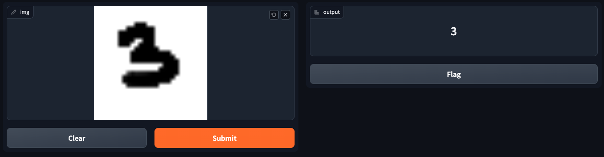

# MNIST Digit Classification Project

This project demonstrates a complete end-to-end implementation of a Convolutional Neural Network (CNN) to classify handwritten digits from the MNIST dataset. The model architecture and training process leverage TensorFlow and Keras, while the final deployment of the model uses Gradio to create an interactive web interface.

## Project Overview

1. **Data Preprocessing**: Load and prepare the MNIST dataset for training and testing.
2. **Model Architecture**: Develop a CNN model with multiple convolutional and pooling layers to classify digits accurately.
3. **Training Process**: Use early stopping to avoid overfitting and optimize model accuracy.
4. **Evaluation**: Assess the model’s performance using a test set to determine final accuracy.
5. **Deployment**: Use Gradio to create an interactive demo for real-time digit classification.

## Installation

Ensure you have the necessary Python packages installed:

```bash
pip install tensorflow matplotlib gradio netron
```

## Project Structure

- `mnist_classification.py`: Main script that includes model training, evaluation, and deployment setup.
- `Saved Model`: The trained model is saved as `mnist_model.keras` for easy loading in deployment.
- `Interactive Interface`: Created using Gradio to allow users to draw digits and get predictions.

## Code Walkthrough

### Data Loading and Visualization

Load the MNIST dataset, visualize sample images, and explore data dimensions.

```python
from tensorflow.keras.datasets import mnist
import matplotlib.pyplot as plt

(train_images, train_labels), (test_images, test_labels) = mnist.load_data()
plt.imshow(train_images[44], cmap='gray')
```

### Data Preprocessing

Reshape and normalize images, and convert labels to categorical format for model training.

```python
train_images = train_images.reshape((60000, 28, 28, 1)).astype('float32') / 255
test_images = test_images.reshape((10000, 28, 28, 1)).astype('float32') / 255
```

### Model Architecture

Define the CNN architecture, including convolutional, pooling, and dense layers.

```python
from tensorflow.keras import models, layers

model = models.Sequential([
    layers.Conv2D(32, (3, 3), activation='relu', input_shape=(28, 28, 1)),
    layers.MaxPooling2D((2, 2)),
    layers.Conv2D(64, (3, 3), activation='relu'),
    layers.MaxPooling2D((2, 2)),
    layers.Conv2D(64, (3, 3), activation='relu'),
    layers.Flatten(),
    layers.Dense(64, activation='relu'),
    layers.Dense(10, activation='softmax')
])
```

### Model Compilation and Training

Compile the model with the Adam optimizer and categorical cross-entropy loss. Implement early stopping to avoid overfitting.

```python
from tensorflow.keras.callbacks import EarlyStopping

early_stopping = EarlyStopping(monitor='accuracy', patience=2)
model.compile(optimizer='adam', loss='categorical_crossentropy', metrics=['accuracy'])
model.fit(train_images, train_labels, epochs=5, batch_size=32, callbacks=[early_stopping])
```

### Model Evaluation

Evaluate the trained model on the test set and save the model.

```python
test_loss, test_acc = model.evaluate(test_images, test_labels)
print('Test accuracy:', test_acc)
model.save('mnist_model.keras')
```

### Interactive Deployment with Gradio

Load the saved model and create an interface to classify user-drawn digits.

```python
import gradio as gr
import numpy as np
import tensorflow as tf

modelo = tf.keras.models.load_model("mnist_model.keras")

def classify_image(img):
    img = np.reshape(img, (1, 28, 28, 1)).astype("float32") / 255
    predictions = modelo.predict(img)
    predicted_digit = np.argmax(predictions)
    return str(predicted_digit)

interface = gr.Interface(fn=classify_image, inputs="sketchpad", outputs="label")
interface.launch()
```



### Model Visualization

Use Netron to visualize the model structure:

```python
import netron
netron.start('mnist_model.keras')
```

## Results

The model achieves an accuracy of approximately 98% on the test dataset, demonstrating strong performance in handwritten digit classification. Early stopping was implemented to improve the generalization of the model.

## Usage

To use the interactive interface, run the following command:

```bash
python mnist_classification.py
```

This launches a web application where users can draw digits, and the model will predict the digit in real-time.

## Acknowledgements

This project uses the MNIST dataset and leverages TensorFlow and Keras for model development. Gradio is used for deploying the model in an interactive application.

## License

This project is licensed under the MIT License.
 
## Author
Rosalía González Caviedes
- [Email](rosaliagonzalezc@gmail.com)
- [Linkedin profile](https://www.linkedin.com/in/rosaliagonzalezcaviedes/)

## Project Date
October 2024